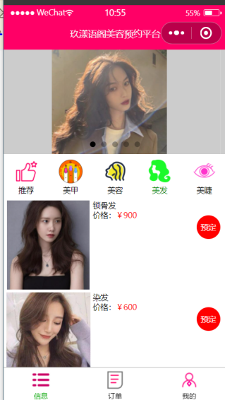
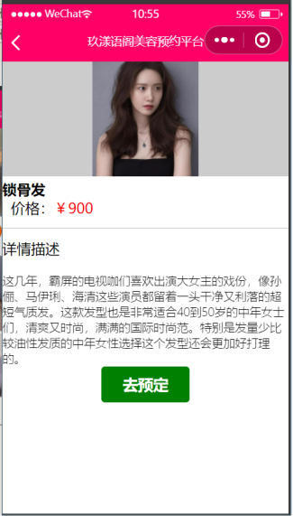
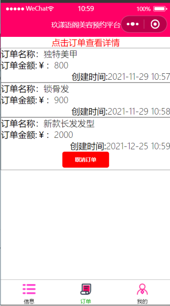
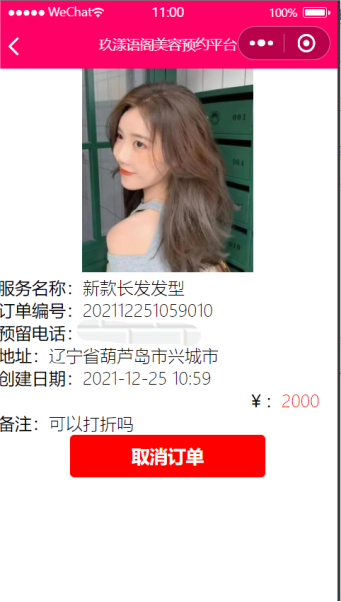
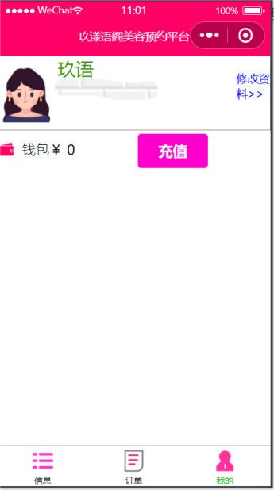
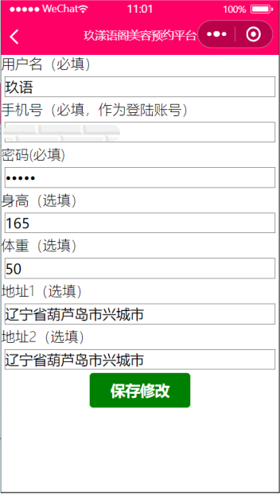

### 微信小程序-美容预约平台

#### 简介

本小程序是一个在线的美容预约平台。其主要服务类型为：美甲，美容，美发，美睫。用户可以通过该平台进行相关服务的预约。

#### 实现技术

##### 简介

本项目是一个前后端分离的一个项目，前端是微信小程序语言，后端是java语言。
技术栈：
用到了spring boot技术栈。即springboot+springmvc+mybatis-plus为主要技术。Mybatis-plus可以在操作单表时极大优化效率，无需写sql语句。

##### 数据库

数据库的设计遵循了设计规范，第三范式，mybatis-plus取数据时用到了表关联查询。详细设计见数据表。

##### 前后端交互

前后端交互主要前端使用微信小程序中ajax请求，即wx.request以json格式向后台传递数据。后端接收后进行相应处理。

#### 小程序功能

##### 信息页

主要是根据服务类型进行服务项目的展示，用户点击服务项目可以查看项目详细信息，点击预定可以进行服务的预定。

##### 订单页

订单页允许用户查看自己至今的订单列表，点击订单可以查看订单详细信息。如果订单未过期允许取消订单。

##### 我的页

允许用户登陆后查看自己的信息即钱包余额。点击修改资料即可跳转到资
修改页。
注意：小程序大部分页面会检查用户登陆状态，未登录提示用户登陆后操作！！！

#### 小程序截图

##### 信息页

##### 订单页

##### 我的页

